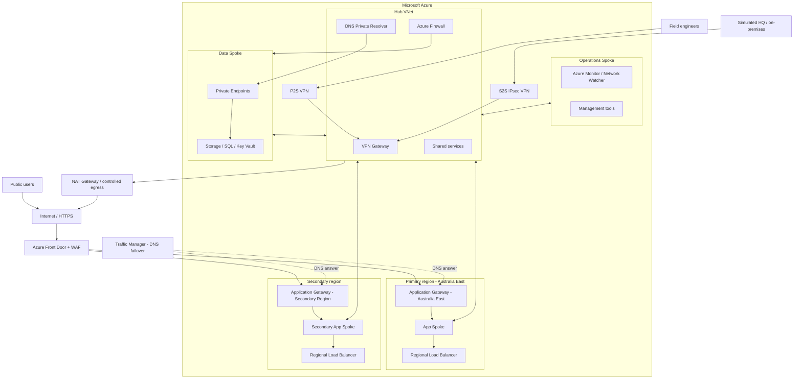

# Project LIFELINE — End-State Architecture

This is the target mental model. We will not deploy all of it at once.



## The question this diagram should answer

At the end of the project you should be able to explain the complete path for a request such as:

```text
User
  -> DNS / global endpoint decision
  -> Front Door or Traffic Manager
  -> regional application delivery
  -> application subnet
  -> routing / security controls
  -> private DNS resolution
  -> Private Endpoint
  -> Azure data service
```

Then you should be able to explain what changes when a region, route, DNS record, VPN tunnel, health probe or security rule fails.

## Design principles

1. **Segmentation:** application, data, operations and shared connectivity have distinct network boundaries.
2. **Centralised connectivity:** the hub hosts shared networking/security services.
3. **Private data access:** platform data services are reached with private endpoints rather than public exposure.
4. **Multiple traffic layers:** DNS routing, Layer 4 load balancing and Layer 7 application delivery solve different problems.
5. **Failure is part of the design:** every major path must be observable and diagnosable.
6. **Cost awareness:** expensive services are deployed only when their lab needs them.
